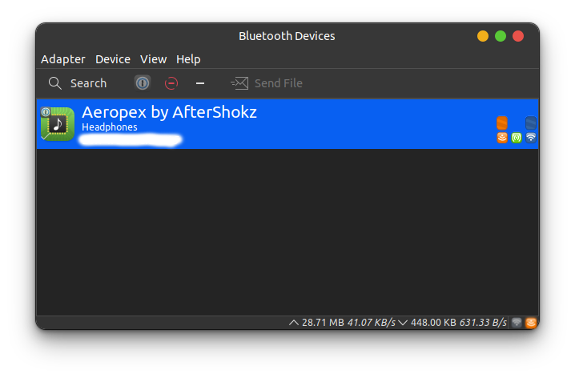

# My General Notes on Bluetooth for Ubuntu 21.10

# Generally Helpful Things Regarding Bluetooth on Ubuntu

## Helpful Extensions

- [Bluetooth Quick Connect](https://extensions.gnome.org/extension/1401/bluetooth-quick-connect/) Gnome Extension: allows for convenient bluetooth connect/disconnect from top panel dropdown

## Connectivity Issues

**Configuration File**: `/etc/bluetooth/main.conf`

- it looks like there is a setting: *Enable Fast Connect* (**might require reboot**) \- this is disabled by default as it has two gotchas:
  - only works on kernel 4.1 or newer (all modern desktops hopefully do so)
  - consumes more power on your PC

Edit the configuration file as root, and change the **FastConnectable** setting to *true* like so:

```config
## Permanently enables the Fast Connectable setting for adapters that
## support it. When enabled other devices can connect faster to us,
## however the tradeoff is increased power consumptions. This feature
## will fully work only on kernel version 4.1 and newer. Defaults to
## 'false'.
##FastConnectable = false
FastConnectable = true
```

## Sound Issues

Ref: [dev.to](https://dev.to/campbelljones74/common-bluetooth-problems-in-ubuntu-and-how-to-fix-them-18b5)

Bluetooth headset not playing in A2DP (High Fidelity) (might seem to work on first connect, but subsequent reconnects don't work)

Install dependencies (was sufficient for me - I think at least **pulseaudio-module-bluetooth** was missing for me)

```bash
sudo apt install pulseaudio pulseaudio-utils pavucontrol pulseaudio-module-bluetooth
```

*I didn't have to do the following*

- verify that `/etc/bluetooth/audio.conf` has the following lines:

```config
##This section contains general options
[General]
Enable=Source,Sink,Media,Socket
```

- Restart the bluetooth service at this point:

```bash
sudo service bluetooth restart
```

### Bluetooth Manager

[Detailed Bluetooth Troubleshooting page from System76](https://support.system76.com/articles/bluetooth/)

They System76 troubleshooting page has a lot of information, but it also recommends **BlueMan**. From the page:

> There is a program called Bluetooth Manager which is included with XFCE. It can sometimes pair and trust Bluetooth devices better than the default Bluetooth settings. Install it with:

```bash
sudo apt install blueman
```

> Then, run Bluetooth Manager. Check for the device being trusted, and also try re-pairing in that program.

At the least, I hope that when the bluetooth system refuses to turn on/connect (still happens at times despite changes listed above), the program will help. Here's what it looks like:


